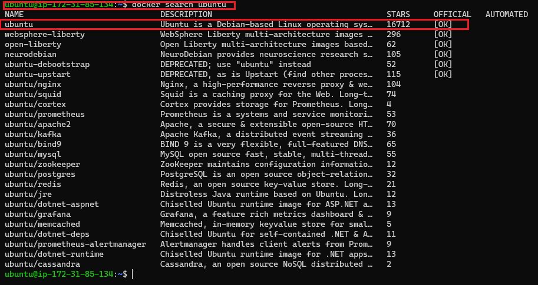

# This is my linux projett
## A second-level heading
### A third-level heading

*This is my linux project*

**This is my linux project**

you need to learn **linux** to become a devops engineer

I want to add a new image

